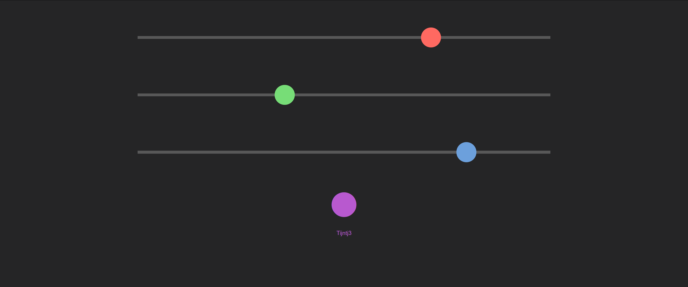

# ESP32 web RGB controller

This repository contains a simple ESP32 NeoPixel RGB strip controller with a web interface. The application is pretty much a copy of the ESP color picker [example](https://randomnerdtutorials.com/esp32-esp8266-rgb-led-strip-web-server/), but with a website that, in my opinion, looks a bit cleaner and is easier to navigate on mobile.

The makefile is there for avoiding the Arduino IDE, but the paths in there probably have to be changed.

## How to use
After building and uploading the application to the board, the three sliders can be used to control the RGB values individually. The larger dot at the bottom will update with a colour preview as the sliders change. When the desired colour has been found, tap/click this dot to confirm and change the colour of the strip.